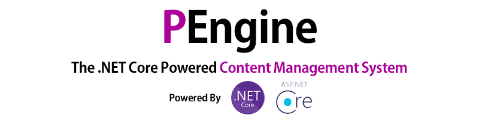

# PEngine Content Management System

    

 

PEngine is a content management system (CMS) for general purpose websites. It is written in C#, powered by ASP.NET Core MVC with Blazor.

## Build Status

|         | Debug | Release | Docker Release |
|---------|-------|---------|----------------|
| Windows |   |  |  |
| Linux   |   |  |  |

## Code Quality Status

| Codacy     |   |
|------------|---|
| CodeFactor |   |

## Supported Database
 * Microsoft SQL Server
 * MySQL/MariaDB
 * PostgreSQL

## How to Build

 * Install [.NET Core 3.1 SDK](https://dotnet.microsoft.com/download)
 * `git clone https://github.com/0x00000FF/PEngine`
 * `dotnet build Solution`

## Contribution

You're always welcomed to contribute to PEngine project. Feel free to make issues or pull request. For example:

 * Code quality improvements
 * Feature improvements
 * Bug fixes
 * or...? ([How about the good first issues?](https://github.com/0x00000FF/PEngine/issues?q=is%3Aissue+is%3Aopen+label%3A%22Good+First+Issue%22))

## Why "PEngine"?

Please refer [KnowledgeVM](https://github.com/0x00000ff/knowledge-vm), then you can figure out that what "P" stands for.
